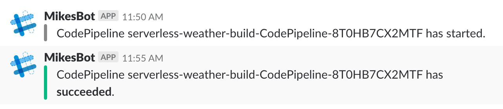

# Code Pipeline Slack Notifier for serverless

This app is originally from Code Pipeline Slack Notifier (https://github.com/symphoniacloud/code-pipeline-slack-notifier)

This small Lambda app will post updates to a Slack channel for pipeline events generated by AWS Code Pipeline.

 

If you have Code Pipelines in multiple accounts / sub-accounts and/or regions then you'll need to deploy this application to each account+region combo that you have your Code Pipelines in.

## Prerequisites

* AWS Account using Code Pipeline. Otherwise there's not much point to this. :)
* [Slack](https://slack.com/) account, and an [**incoming webhook**](https://api.slack.com/incoming-webhooks) URL 
you can use to post to it. This will be something like `https://hooks.slack.com/services/....`
* An AWS user with sufficient privileges to deploy the application from the AWS Serverless Application Repository
* Serverless framework(https://serverless.com/) is required

## Setup

Edit your serverless.yml as you wish:

    ```bash
    $ npm install

    $ sls deploy --stage {your_stage_name}


## Testing

If you'd like to test the app, you can configure the following test event in the Lambda console, and test there:

```json
{
  "version": "0",
  "id": "d852b55d-a96a-e396-2e34-107bc39d1e21",
  "detail-type": "CodePipeline Pipeline Execution State Change",
  "source": "aws.codepipeline",
  "account": "123456789012",
  "time": "2018-02-23T16:54:45Z",
  "region": "us-west-2",
  "resources": [
    "arn:aws:codepipeline:us-west-2:123456789012:serverless-weather-build-CodePipeline-ABCDEFGHIJKL"
  ],
  "detail": {
    "pipeline": "serverless-weather-build-CodePipeline-ABCDEFGHIJKL",
    "execution-id": "1620f6b6-6731-4d93-aa3c-123456789012",
    "state": "STARTED",
    "version": 1
  }
}
```


## Teardown

To teardown the notifier delete the stack through the Web Console, or use the incantation below:

```bash
$ sls remove --stage {your_stage_name}
```

-----
Apache License 2.0